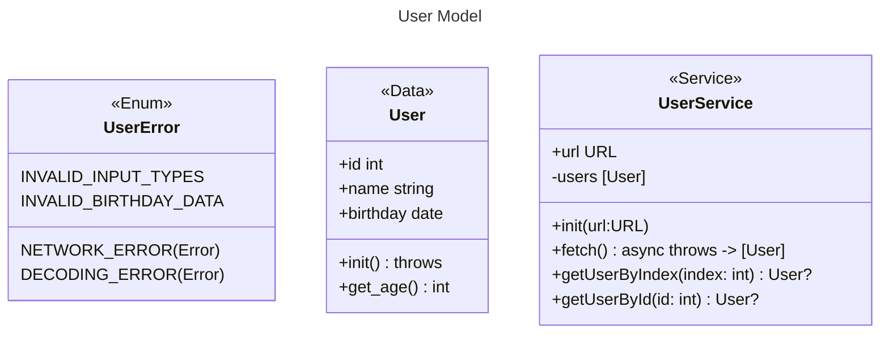

```mermaid
---
title: User Model
---
classDiagram
    class UserError {
        <<Enum>>
        INVALID_INPUT_TYPES
        NETWORK_ERROR(Error)
        DECODING_ERROR(Error)
        INVALID_BIRTHDAY_DATA
    }

    class User {
        <<Data>>
        +id int
        +name string
        +birthday date

        +init() throws
        +get_age() int
    }

  	class UserService {
        <<Service>>
        +url URL
        -users [User]

        +init(url:URL)
        +fetch() async throws -> [User]
        +getUserByIndex(index: int) User?
        +getUserById(id: int) User?
    }

```
