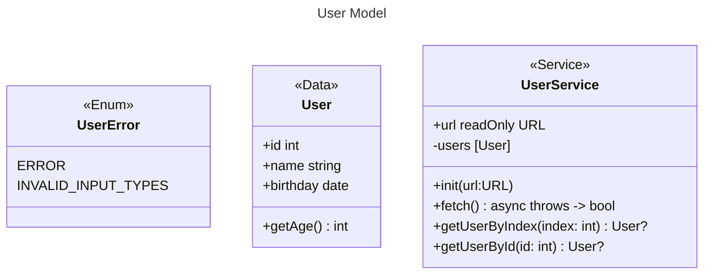

## 設計

```yaml
openapi: 3.0.0
# 基本情報
info:
  title: Userリスト API
  description: この API を使用すると、クライアントはUserのリストを取得できます。
  version: 1.0.0
servers:
  - url: https://api.demo.com
paths:
  /users:
    get:
      summary: ユーザーリスト取得

      # レスポンスの定義
      responses:
        "200":
          description: ユーザーリスト
          content:
            application/json:
              schema:
                type: array
                items:
                  $ref: "#/components/schemas/User"

# データスキーム
components:
  schemas:
    User:
      type: object
      properties:
        id:
          type: integer
        name:
          type: string
        birthday:
          type: string
          format: date
```

```gherkin
Feature: User schema validation

  # 正常系

  Scenario: 正常系 - 正常ユーザー
    Given response : `[ { "id": 1, "name": "John Doe", "birthday": "1980-01-01" } ]`
    When Userスキーマに対してJSONレスポンスを検証する
    Then true

  Scenario: 正常系 - 正常ユーザー（複数）
    Given response : `[ { "id": 1, "name": "John Doe", "birthday": "1980-01-01" }, { "id": 2, "name": "Jane Doe", "birthday": "1985-02-02" }, { "id": 3, "name": "Jim Doe", "birthday": "1990-03-03"} ]`
    When Userスキーマに対してJSONレスポンスを検証する
    Then true

  # 異常系

  Scenario: 異常系 - id不正ユーザー
    Given response : `[ { "id": "invalid", "name": "John Doe", "birthday": "1980-01-01" } ]`
    When Userスキーマに対してJSONレスポンスを検証する
    Then false

  Scenario: 異常系 - name不正ユーザー
    Given response : `[ { "id": 1, "name": 123, "birthday": "1980-01-01" } ]`
    When Userスキーマに対してJSONレスポンスを検証する
    Then false

  Scenario: 異常系 - birthday不正ユーザー
    Given response : `[ { "id": 1, "name": "John Doe", "birthday": "invalid-date" } ]`
    When Userスキーマに対してJSONレスポンスを検証する
    Then false
```


