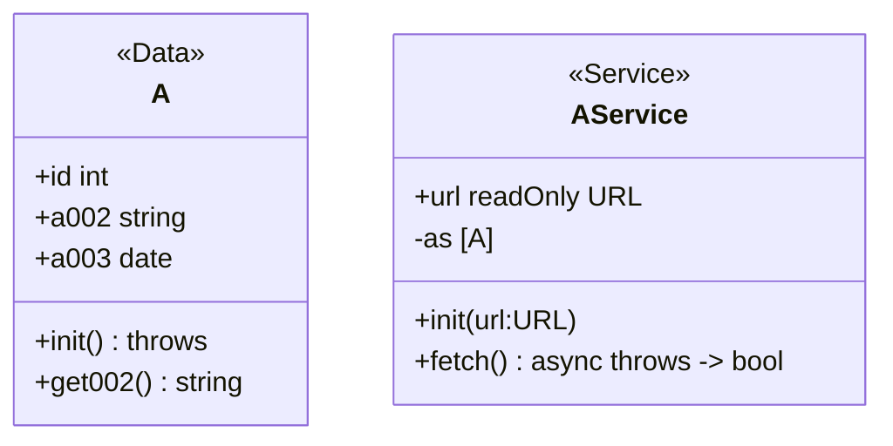

次のタスクを実行してください

## タスク

こちらの コードと、gherkin 形式の`テストケース`をもとに Jest での UnitTest コードを作成してください

## 例



```gherkin
### AService

Feature: AService

  # 正常系

  ## メソッド

  Scenario: fetch - 正常ユーザー
    Given APIレスポンス: `[ { "id": 1, "a002": "りんご", "a003": "2021-07-16" } ]`
    When fetchメソッドを呼び出す
    Then true

```

```js
describe("AService", () => {
  describe("正常系", () => {
    describe("メソッド", () => {
      it("fetch - 正常ユーザー", () => {
        const userService = new UserService("http://example.com");
        fetch.mockResponseOnce(JSON.stringify([ { "id": 1, "a002": "りんご", "a003": "2021-07-16" } ]));
        const result = await userService.fetch();
        expect(result).toBe(true);
      });
    });
  });
});
```

---

## テストケース

```gherkin
# UserService

Feature: UserService

  # 正常系

  ## メソッド

  Scenario: fetch - 正常ユーザー（複数）
    Given APIレスポンス: `[ { "id": 1, "name": "John Doe", "birthday": "1980-01-01" }, { "id": 2, "name": "Jane Doe", "birthday": "1985-02-02" }, { "id": 3, "name": "Jim Doe", "birthday": "1990-03-03"} ]`
    When fetchメソッドを呼び出す
    Then true

  Scenario: getUserByIndex - 正常ユーザー
    Given UserServiceのインスタンスが存在し、fetchメソッドが既に呼び出されている
    When getUserByIndexメソッドで有効なindex 0を指定する
    Then Userオブジェクトが返される

  Scenario: getUserById - 正常ユーザー
    Given UserServiceのインスタンスが存在し、fetchメソッドが既に呼び出されている
    When getUserByIdメソッドで有効なid 1を指定する
    Then Userオブジェクトが返される

  # 異常系

  ## メソッド

  Scenario: fetch - 無効な URL
    Given UserServiceのインスタンスが存在し、無効なURL "http://invalid-url" が設定されている
    When 無効なURLでfetchメソッドを呼び出す
    Then UserError.ERROR

  Scenario: getUserByIndex - 無効なインデックス
    Given UserServiceのインスタンスが存在し、fetchメソッドが既に呼び出されている
    When getUserByIndexメソッドで無効なindex -1を指定する
    Then nullが返される

  Scenario: getUserById - 無効なid
    Given UserServiceのインスタンスが存在し、fetchメソッドが既に呼び出されている
    When getUserByIdメソッドで無効なid -1を指定する
    Then nullが返される

  ### schema validation

  Scenario: fetch - id不正ユーザー
    Given APIレスポンス: `[ { "id": "invalid", "name": "John Doe", "birthday": "1980-01-01" } ]`
    When fetchメソッドを呼び出す
    Then UserError.INVALID_INPUT_TYPES

  Scenario: fetch - name不正ユーザー
    Given APIレスポンス: `[ { "id": 1, "name": 123, "birthday": "1980-01-01" } ]`
    When fetchメソッドを呼び出す
    Then UserError.INVALID_INPUT_TYPES

  Scenario: fetch - birthday不正ユーザー
    Given APIレスポンス: `[ { "id": 1, "name": "John Doe", "birthday": "invalid-date" } ]`
    When fetchメソッドを呼び出す
    Then UserError.INVALID_INPUT_TYPES

  ## プロパティ

  Scenario: UserService.url
    Given UserServiceのインスタンスが存在し、URL "http://valid-url" が設定されている
    When `url`プロパティ(readOnly)に "http://new-url" を設定しようとする
    Then 変更はできない

  Scenario: UserService.users
    Given UserServiceのインスタンスが存在する
    When `users`プロパティ(プライベート変数)に直接アクセスしようとする
    Then アクセスはできない
```
