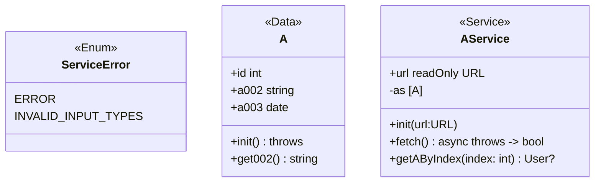

次のタスクを実行してください

## タスク

### こちらの OpenAPI、schema validation、mermaid の Class 図をもとに下記のタスクを実行してください

- `UserService` のテストケースを gherkin 形式で網羅的に書き出してください（API レスポンスはモックを使用）

  - 正常系
    - メソッド
  - 異常系
    - メソッド
      - schema validation
    - プロパティ
  - 他にあなたが気付く項目

## 例

### Input

```yaml
components:
  schemas:
    A:
      type: object
      properties:
        id:
          type: integer
        a002:
          type: string
        a003:
          type: string
          format: date
```

```gherkin
Feature: A schema validation

  # 正常系

  Scenario: 正常系 - 正常ユーザー
    Given responce : `[ { "id": 1, "a002": "Sample string", "a003": "2021-07-16" } ]`
    When Aスキーマに対してJSONレスポンスを検証する
    Then true

  Scenario: 正常系 - 正常ユーザー（複数）
    Given responce : `[ { "id": 1, "a002": "りんご", "a003": "2021-07-16" }, { "id": 2, "a002": "ばなな", "a003": "2022-08-20" }, { "id": 3, "a002": "さぶろう", "a003": "2023-01-01"} ]`
    When Aスキーマに対してJSONレスポンスを検証する
    Then true

  ~


  # 異常系

  Scenario: 異常系 - id不正ユーザー
    Given responce : `[ { "id": 1, "a002": "Sample string", "a003": "2021-07-16" } ]`
    When Aスキーマに対してJSONレスポンスを検証する
    Then false

  ~

```



### Output

- gherkin 形式でアウトプットしてください

```gherkin

# AService

Feature: AService

  # 正常系

  ## メソッド

  Scenario: fetch - 正常ユーザー（複数）
    Given APIレスポンス: `[ { "id": 1, "a002": "りんご", "a003": "2021-07-16" }, { "id": 2, "a002": "ばなな", "a003": "2022-08-20" }, { "id": 3, "a002": "さぶろう", "a003": "2023-01-01"} ]`
    When fetchメソッドを呼び出す
    Then true

  ~

  # 異常系

  ## メソッド

  Scenario: fetch - 無効な URL
    Given UserServiceの初期化時に無効なURL "http://invalid-url" が設定されている
    When 無効なURLでfetchメソッドを呼び出す
    Then throw StoreError.ERROR

  Scenario: getAByIndex - 無効なインデックス
    Given AServiceのインスタンスが存在する
    And fetchメソッドが既に呼び出されている
    When getUserByIndexメソッドで無効なindex -1を指定する
    Then return null

  ~

  ### schema validation

  Scenario: fetch - id不正ユーザー
    Given APIレスポンス: `[ { "id": "太郎", "a002": "あいちけん", "a003": "2021-07-16" } ]`
    When fetchメソッドを呼び出す
    Then throw StoreError.INVALID_INPUT_TYPES

  ~

  ## プロパティ

  Scenario: AService.url
    Given UserServiceのインスタンスが存在し、URL "http://valid-url" が設定されている
    When `url`プロパティ(readOnly)に "http://new-url" を設定しようとする
    Then 変更はできない

  Scenario: AService.as
    Given UserServiceのインスタンスが存在する
    When `as`プロパティ(プライベート変数)に直接アクセスしようとする
    Then アクセスはできない
```
